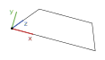

# ar-chess-horus
Cet outil a été créé dans le contexte d'un projet plus vaste demandant des éléments de réalité augmentée, plus précisément la détection d'un marqueur multipoint fourni dans resources. Lorsque la caméra détecte ce marqueur, il effectue des opérations trigonométriques et matricielles pour retrouver la position et la rotation de la caméra dans un repère défini comme suit:

Le programme pourrait être utilisé indépendemment, cependant seul le marqueur fourni et reconnu, et une configuration et calibration pour votre caméra serait à envisager.

# Installation
Avant de commencer, assurez vous d'avoir une installation fonctionnelle de opencv, qui reconnait correctement votre Webcam.
Lancer ensuite la commande `git clone https://github.com/SevenMoor/ar-chess-horus && cd ar-chess-horus && ./install.sh && rm -rf .`. Savourez!

# Utilisation
Pour lancer le programme avec les paramètres par défaut, utilisez la commande `ar-horus`. Cependant ceci est déconseillé car les caractéristiques matérielles varient beaucoup d'une webcam à l'autre. Il existe un fichier de configuration `/opt/ar-chess-horus/horus.cfg` modifiable à la main, mais on pourra aussi fournir la configuration à l'exécution à l'aide de différents paramètres:
- `-c x` ou `--calibrate x` avec *x* la lettre identifiant le marqueur à calibrer. Une interface graphique se lance affichant une vue de la caméra, un masque sur les couleurs à accepter comme marqueur, et un détecteur de contours pour les quadrilatères. Un petite fenêtre permet d'ajuster la valeur à accepter avec sa tolérance au format hsv. On enregistre en appuyant sur s, et on quitte avec q.
- `-p file` ou `--pipe file` pour fournir le nom du pipe nommé à utiliser pour transmettre les informations.
- `-w id` ou `--webcam id` pour fournir l'identifiant (nombre entier) de la caméra à utiliser comme entrée.
- `-f size` ou `--focal size` pour fournir la focale de la caméra. Cette valeur est enregistrée pour les utilisations suivantes.
- `-b size` ou `--board size` pour fournir la distance réelle entre les marqueurs adjacents.
- `--integration-test` signifie d'utiliser des données factices pour tester l'intégration.
